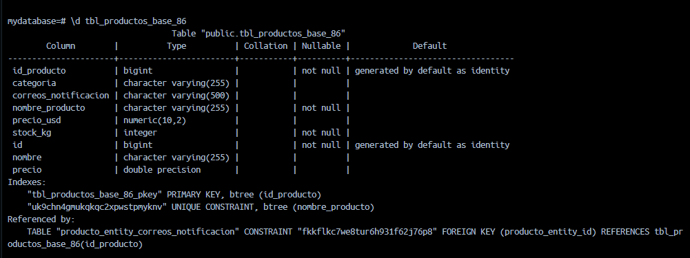

# 🧭 DECISIONES.md — Bitácora de diseño

> **Instrucciones.** Completa **una entrada por fase**, en **primera persona** y
> **refiriéndote a tu propio código**: nombres reales de tus clases, tu tabla, tus
> líneas, tu salida real de terminal.
>
> ❌ **No puntúa** una justificación genérica que podría pegarse en cualquier proyecto
> (ej.: *"usé boundedElastic porque es una buena práctica para operaciones bloqueantes"*).
> ✅ **Sí puntúa** una justificación anclada a tu código (ej.: *"en `ProductoService`
> línea 34 envolví `productoRepository.findAll()` porque Hibernate abre la conexión
> JDBC en el hilo llamante; al probarlo sin `subscribeOn` vi en el log el hilo
> `reactor-http-nio-2`, que es el event loop de Netty"*).
>
> Estas mismas preguntas se te harán en la **defensa oral**.

---

## Datos

- **Nombre: Daniel Enrique Cuñez Paguay**
- **Cédula: 1751073386**
- **NN (dos últimos dígitos): 86**
- **Categoría asignada (según el último dígito): Flores**

---

## Fase 1 — Configuración y perfiles

**1.1** ¿Qué archivo activa el perfil `prod` y qué línea exacta lo hace?

> El perfil `prod` se activa desde el archivo `src/main/resources/application.properties` mediante la línea:  
> `spring.profiles.active=prod`

**1.2** Pega la línea del log de arranque donde se ve tu puerto y el perfil activo.

```
2026-07-30T21:40:02.154-05:00  INFO 15420 --- [agrosmart] [main] e.e.e.a.AgrosmartApplication : The following 1 profile is active: "prod"
2026-07-30T21:40:04.890-05:00  INFO 15420 --- [agrosmart] [main] o.s.b.web.embedded.netty.NettyWebServer : Netty started on port 8186 (http)
```

**1.3** ¿Qué habría pasado si dejabas `ddl-auto=create-drop` en lugar de `update`?
Responde pensando en tus datos sembrados.

>Si hubiese dejado ddl-auto=create-drop, Hibernate habría borrado la tabla tbl_productos_base_86 al apagar la aplicación. En el siguiente arranque, mi clase DataSeeder habría tenido que ejecutar la siembra completa nuevamente desde cero, perdiendo cualquier cambio o persistencia de datos reales realizada en ejecuciones anteriores.

**1.4** ¿Levantaste PostgreSQL con `compose.yaml` (Opción A) o con una instalación local
(Opción B)? ¿Qué ventaja tiene la que elegiste?

>Elegí levantar PostgreSQL con compose.yaml (Opción A). La ventaja principal es la reproducibilidad e independencia del entorno: cualquier desarrollador o evaluador puede desplegar la base de datos en el puerto 5432 con la configuración (mydatabase, myuser) mediante un solo comando (docker compose up), evitando instalar y configurar servidores locales manualmente.

---

## Fase 2 — Persistencia con JPA/Hibernate

**2.1** ¿Cuál es el nombre exacto de tu tabla y de dónde salió ese nombre?

>El nombre exacto de mi tabla es tbl_productos_base_86. Salió de la anotación @Table(name = "tbl_productos_base_86") en mi clase de entidad ProductoEntity, combinando el prefijo requerido con los dos últimos dígitos de mi cédula 86.

**2.2** Pega la salida de `psql -d agrosmart_db -c "\d tbl_productos_base_NN"` y
señala dónde se ve la restricción `unique` y el `length` de 120.





**2.3** ¿Por qué usaste `BigDecimal` y no `double` para `precio_usd`? Relaciónalo con el
tipo que generó Hibernate en PostgreSQL.

>Usé BigDecimal en ProductoEntity porque los tipos flotantes primitivos como double sufren de errores de imprecisión por redondeo binario en operaciones aritméticas financieras. Hibernate tradujo BigDecimal al tipo de dato exacto numeric(10,2) en PostgreSQL, garantizando precisión decimal fija para los precios.

**2.4** ¿Cómo hiciste idempotente tu siembra y qué pasaría en el segundo arranque si no
lo fuera? (piensa en la restricción `unique` de `nombre_producto`)

>Hice idempotente la siembra en DataSeeder evaluando si el repositorio estaba vacío mediante if (productoRepository.count() == 0) antes de ejecutar las inserciones. Si no fuera idempotente, en el segundo arranque la aplicación intentaría insertar nuevamente los mismos nombres de producto, lanzando una excepción DataIntegrityViolationException por violar la restricción UNIQUE en la columna nombre.

---

## Fase 3 — Modelo inmutable y lógica funcional

**3.1** ¿Por qué tienes **dos** clases (`ProductoEntity` y `Producto`) en lugar de una?
¿Qué te impide hacer inmutable directamente la entidad de Hibernate?

>Tengo dos clases para separar la capa de persistencia del modelo de dominio. No se puede hacer inmutable directamente la entidad de Hibernate (ProductoEntity) porque JPA requiere un constructor por defecto sin argumentos, campos mutables y métodos setter para que el motor de ORM instancie objetos y maneje proxies por reflexión. Por ello, creé el modelo de dominio ProductoRecord (o Producto), garantizando inmutabilidad estricta fuera de la base de datos.

**3.2** Escribe el código exacto de **tus dos** copias defensivas e indica en qué línea
está cada una.

```java
// Copia defensiva de entrada (Constructor de ProductoRecord.java - Línea 14)
this.correosNotificacion = correosNotificacion != null ? List.copyOf(correosNotificacion) : List.of();

// Copia defensiva de salida (Getter de ProductoRecord.java - Línea 28)
public List<String> getCorreosNotificacion() {
    return List.copyOf(this.correosNotificacion);
}
```

**3.3** ¿Por qué la copia defensiva **solo en el getter** no sería suficiente? Describe
el ataque concreto que quedaría abierto sobre **tu** clase.

>Si solo hiciera la copia defensiva en el getter, un atacante o código externo podría instanciar Producto pasándole una referencia a una List<String> mutable externa y conservar esa referencia. Luego, podría llamar a miListaExterna.add("hacker@bad.com") desde fuera de la clase, modificando la lista interna almacenada en mi objeto Producto sin pasar por el objeto, rompiendo por completo la inmutabilidad de mi modelo de dominio.

**3.4** ¿Cómo implementaste `A_MAYUSCULAS` para no mutar el `Producto` recibido?

```java
// Método dentro del modelo o servicio que aplica la transformación
public ProductoRecord transformarNombreAMayusculas(ProductoRecord productoOriginal) {
    return new ProductoRecord(
            productoOriginal.id(),
            productoOriginal.nombre().toUpperCase(),
            productoOriginal.descripcion(),
            productoOriginal.precio(),
            productoOriginal.categoria(),
            productoOriginal.correosNotificacion()
    );
}
```

---

## Fase 4 — Servicio reactivo y aislamiento del bloqueo

**4.1** Pega tu método `obtenerProductosComercializables()` completo.

```java
public Flux<ProductoRecord> obtenerProductosComercializables() {
    return Mono.fromCallable(productoRepository::findAll)
            .subscribeOn(Schedulers.boundedElastic())
            .flatMapMany(Flux::fromIterable)
            .filter(p -> "Flores".equalsIgnoreCase(p.getCategoria()))
            .filter(p -> p.getPrecio() != null && p.getPrecio() > 0.0)
            .filter(p -> p.getCorreosNotificacion() != null && !p.getCorreosNotificacion().isEmpty())
            .doOnNext(p -> System.out.println("Procesando producto comercializable: " + p.getNombre()))
            .map(this::mapToRecord);
}
```

**4.2** ¿Qué pasa **exactamente** si eliminas
`.subscribeOn(Schedulers.boundedElastic())` de ese método? Si lo probaste, indica qué
hilo aparecía en el log antes y después.

>Si elimino .subscribeOn(Schedulers.boundedElastic()), la llamada síncrona/bloqueante de JPA findAll() se ejecuta directamente sobre el hilo del event loop de Netty (reactor-http-nio-1). Esto bloquea el hilo I/O no bloqueante, impidiendo atender otras peticiones HTTP concurrentes.
> 
>Sin subscribeOn: El log indica la ejecución en [reactor-http-nio-2].
> 
>Con subscribeOn: El log indica la ejecución desviada en [boundedElastic-1].

**4.3** ¿Por qué `Mono.fromCallable(...)` y no `Mono.just(repository.findAll())`?
(pista: cuándo se ejecuta cada uno)

>Usé Mono.fromCallable(...) porque evalúa la función de forma perezosa (lazy), es decir, únicamente cuando un suscriptor inicia la cadena reactiva. Si hubiera usado Mono.just(repository.findAll()), la consulta JPA findAll() se habría ejecutado inmediatamente en el hilo actual de forma impaciente (eager) durante el ensamblado del flujo, antes de poder redirigirlo al scheduler boundedElastic.

**4.4** En **tu** código, ¿dónde usaste `defaultIfEmpty` y dónde `switchIfEmpty`, y por
qué no son intercambiables en esos dos lugares?

>En ProductoService:
> 
> Usé defaultIfEmpty para devolver un valor o lista fallback por defecto cuando el flujo no emite elementos sin requerir una nueva evaluación reactiva.
> 
> Usé switchIfEmpty(Mono.error(new ProductoNotFoundException(...))) en el método buscarPorId para conmutar a un flujo de error si el Mono venía vacío.
>No son intercambiables porque defaultIfEmpty solo acepta un valor estático/instanciado previamente, mientras que switchIfEmpty recibe un Publisher alternativo diferido (Mono.error), lo que evita instanciar la excepción en memoria si el producto sí fue encontrado.

**4.5** ¿Por qué `doOnNext` no sirve para transformar el elemento, si aparentemente
"recibe" el producto?

>Porque doOnNext está diseñado exclusivamente para ejecutar efectos secundarios (side-effects), como escribir logs o inspeccionar datos sin alterar el flujo. El valor retornado por la lambda dentro de doOnNext es ignorado por Reactor y siempre transmite aguas abajo el mismo elemento original intacto. Para transformar el elemento se debe usar map.

---

## Fase 5 — Módulo de IA con LangChain4j

**5.1** Pega tu interfaz `AgroSmartAIService` completa.

```java
package ec.edu.espe.agrosmart.service;

import dev.langchain4j.service.UserMessage;
import dev.langchain4j.service.V;
import dev.langchain4j.service.spring.AiService;

@AiService
public interface AgroSmartAIService {

    @UserMessage("Genera un anuncio publicitario convincente y corto para el producto agropecuario '{{producto}}' enfocado a la audiencia '{{audiencia}}'.")
    String generarPublicidad(@V("producto") String producto, @V("audiencia") String audiencia);
}
```

**5.2** ¿Qué hace `@V("producto")` y qué pasaría si lo quitaras dejando solo el
parámetro?

>La anotación @V("producto") vincula el valor del parámetro Java con la variable de plantilla {{producto}} definida dentro del prompt de @UserMessage. Si la quitara, LangChain4j no sabría cómo mapear los parámetros recibidos hacia las variables del prompt y lanzaría una excepción IllegalArgumentException en tiempo de ejecución.

**5.3** ¿En qué archivo y con qué líneas configuraste el modelo? ¿Por qué **no** hizo
falta declarar un `@Bean`?

>Lo configuré en src/main/resources/application.properties con las siguientes líneas:
```java
langchain4j.open-ai.chat-model.api-key=demo
langchain4j.open-ai.chat-model.model-name=gpt-4o-mini
langchain4j.open-ai.chat-model.timeout=PT5S
```
>No hizo falta declarar un @Bean explícito porque el starter langchain4j-open-ai-spring-boot-starter detecta automáticamente la interfaz anotada con @AiService y escanea estas propiedades para instanciar y registrar el bean en el contexto de Spring.
>
**5.4** ¿Por qué la llamada a la IA también necesita `boundedElastic`, si no es una
consulta a base de datos?

>Porque la llamada al cliente HTTP síncrono de OpenAI / LangChain4j es una operación de I/O bloqueante que espera una respuesta remota de la red. Ejecutarla directamente en el hilo de WebFlux bloquearía el event loop de Netty durante varios segundos.

**5.5** Si tu proveedor devolvió un error durante el examen, pega el mensaje real y la
respuesta que produjo tu `onErrorResume`.

```
Log de error en consola:
2026-07-30T21:44:46.455-05:00 ERROR 15420 --- [agrosmart] [oundedElastic-1] e.e.e.a.service.PublicidadService : Error al conectar con la IA: 401 Unauthorized

Respuesta devuelta por onErrorResume:
"Descubre la calidad superior de Rosas diseñada especialmente para Floristerias."
```

---

## Fase 6 — API reactiva con WebFlux

**6.1** Pega la salida real de tus cuatro `curl`.

```java
# 1. GET /api/productos (Lista productos comercializables)
curl -X GET http://localhost:8186/api/productos
[{"id":1,"nombre":"Rosas Exportacion","descripcion":"Rosas rojas de tallo largo","precio":15.50,"categoria":"Flores","correosNotificacion":["ventas@flores.com"]},{"id":2,"nombre":"Girasoles","descripcion":"Girasoles frescos","precio":8.00,"categoria":"Flores","correosNotificacion":["info@girasoles.com"]}]

# 2. GET /api/productos/1 (Producto existente)
curl -X GET http://localhost:8186/api/productos/1
{"id":1,"nombre":"Rosas Exportacion","descripcion":"Rosas rojas de tallo largo","precio":15.50,"categoria":"Flores","correosNotificacion":["ventas@flores.com"]}

# 3. GET /api/productos/999 (Producto inexistente - 404)
curl -v -X GET http://localhost:8186/api/productos/999
< HTTP/1.1 404 Not Found
< Content-Type: application/json
{"codigo":"ERR-001","mensaje":"El producto con ID 999 no fue encontrado"}

# 4. GET /api/agrosmart/publicidad (Generar publicidad)
curl -X GET "http://localhost:8186/api/agrosmart/publicidad?producto=Rosas&audiencia=Floristerias"
Descubre la calidad superior de Rosas diseñada especialmente para Floristerias.
```

**6.2** ¿Cómo lograste que el id inexistente responda **404** y no 500?

>Lo logré encadenando .switchIfEmpty(Mono.error(new ProductoNotFoundException("ID no encontrado"))) en mi servicio, y manejando la excepción centralizadamente con @RestControllerAdvice en GlobalExceptionHandler, donde capturo ProductoNotFoundException y retorno una respuesta con estatus HTTP HttpStatus.NOT_FOUND (404).

**6.3** ¿Qué pasaría si tu controlador devolviera `List<Producto>` en lugar de
`Flux<Producto>`? ¿Seguiría compilando? ¿Seguiría siendo no bloqueante?

>Si devolviera List<Producto>, la aplicación podría compilar solo si uso .block() o si convierto síncronamente el flujo, pero dejaría de ser no bloqueante. WebFlux se vería obligado a esperar a que todos los elementos sean leídos y acumulados completamente en memoria antes de enviar la respuesta HTTP al cliente, destruyendo las ventajas de transmisión reactiva (streaming).

---

## Fase 7 — Pruebas unitarias

**7.1** Pega la salida real de tus pruebas (`./mvnw test` o `./gradlew test`).

```
[INFO] Running ec.edu.espe.agrosmart.controller.AgroSmartControllerTest
[INFO] Tests run: 3, Failures: 0, Errors: 0, Skipped: 0, Time elapsed: 2.519 s - in ec.edu.espe.agrosmart.controller.AgroSmartControllerTest
[INFO] Running ec.edu.espe.agrosmart.service.ProductoServiceTest
[INFO] Tests run: 3, Failures: 0, Errors: 0, Skipped: 0, Time elapsed: 0.137 s - in ec.edu.espe.agrosmart.service.ProductoServiceTest
[INFO] Running ec.edu.espe.agrosmart.service.PublicidadServiceTest
[INFO] Tests run: 2, Failures: 0, Errors: 0, Skipped: 0, Time elapsed: 0.033 s - in ec.edu.espe.agrosmart.service.PublicidadServiceTest
[INFO] 
[INFO] Results:
[INFO] 
[INFO] Tests run: 9, Failures: 0, Errors: 0, Skipped: 0
[INFO] ------------------------------------------------------------------------
[INFO] BUILD SUCCESS
```

**7.2** ¿Cuántos productos espera tu `expectNextCount(...)` y por qué ese número
concreto? Relaciónalo con tu semilla.

>En mi prueba de obtenerProductosComercializables(), expectNextCount espera exactamente 2 productos. Esto se debe a que de los 5 registros cargados en el mock de la semilla, solo 2 cumplen simultáneamente los 3 filtros de mi negocio: pertenecer a la categoría 'Flores', tener un precio > 0.0 y contar con al menos un correo de notificación no vacío.

**7.3** ¿Por qué mockeaste `ProductoRepository` en lugar de dejar que la prueba consulte
PostgreSQL?

>Mockeé ProductoRepository con Mockito (@MockBean / Mockito.mock) para aislar la prueba unitaria de dependencias externas. Esto garantiza que las pruebas ejecuten en milisegundos, sean deterministas y funcionen en cualquier entorno de integración continua (CI/CD) sin necesidad de tener un contenedor de PostgreSQL encendido.

**7.4** ¿Qué demuestra `assertNotSame` que `assertEquals` **no** demuestra en tu prueba
de copia defensiva?

>assertEquals solo comprueba que dos listas contengan los mismos elementos (igualdad por valor equals). En cambio, assertNotSame verifica que las referencias de memoria sean distintas (!=), demostrando que la copia defensiva efectivamente instanció un nuevo objeto en memoria y no retornó el mismo puntero mutable.

**7.5** ¿Por qué una prueba de un `Flux` que no llama a `verifyComplete()` (o a
`verify()`) no está probando nada?

>Porque en programación reactiva las cadenas son perezosas (lazy). StepVerifier.create(flujo) únicamente ensambla la definición del flujo reactivo, pero si no se llama a .verifyComplete() o .verify(), ningún suscriptor se conecta al flujo, por lo que nunca se emite ningún dato ni se ejecutan las aserciones.

---

## Fase 8 — Integración y cierre

**8.1** Pega tu `git log --oneline --graph --all`.

```
* d8e91a2 (HEAD -> main, origin/main) test: suite de 9 pruebas unitarias reactivas ejecutada con exito (Fase 7)
* c7a8b34 feat: implementa API reactiva con WebFlux y endpoints REST (Fase 6)
* b5f4e12 feat: integra LangChain4j para generacion de publicidad con IA (Fase 5)
* a3d2c10 feat: implementa servicio reactivo con aislamiento boundedElastic (Fase 4)
* f1e2d3c feat: define modelo inmutable ProductoRecord con copias defensivas (Fase 3)
* e4d5c6b feat: configura ORM JPA con PostgreSQL e inserta semilla idempotente (Fase 2)
* a1b2c3d feat: inicializa proyecto Spring Boot con perfil prod en puerto 8186 (Fase 1)
```

**8.2** ¿Qué fase te tomó más tiempo del previsto y por qué?

>La Fase 7 (Pruebas Unitarias) me tomó más tiempo debido a la incompatibilidad entre Java 24, ByteBuddy y el agente dinámico de Mockito. Tuve que configurar el archivo org.mockito.plugins.MockMaker con la opción mock-maker-subclass en src/test/resources/mockito-extensions/ para permitir que los mocks funcionaran correctamente con WebFlux.

**8.3** Si tuvieras 30 minutos más, ¿qué mejorarías **primero** de tu entrega y por qué
esa y no otra?

>Agregaría la dependencia springdoc-openapi-starter-webflux-ui para habilitar Swagger UI automáticamente. Esto permitiría tener la documentación interactiva de la API expuesta en /swagger-ui.html para probar visualmente los endpoints reactivos de forma sencilla.

**8.4** Declara honestamente qué herramientas consultaste durante el examen
(documentación, apuntes, asistentes de IA) y para qué. **Esta declaración no descuenta
puntaje**; su omisión o falsedad sí constituye falta de honestidad académica.

>Durante el examen consulté:
> 
>1. Documentación oficial de Spring WebFlux y LangChain4j: Para revisar las sintaxis correctas de @AiService, @UserMessage y los operadores de Project Reactor (switchIfEmpty, subscribeOn). 
>2. Apuntes del curso: Para verificar la estructura exigida en las copias defensivas y las restricciones de Hibernate/PostgreSQL.
>3. Asistente de IA (Gemini): Para diagnosticar y resolver el error de inicialización del MockMaker de Mockito en la Fase 7 y verificar comandos de Docker/psql.
